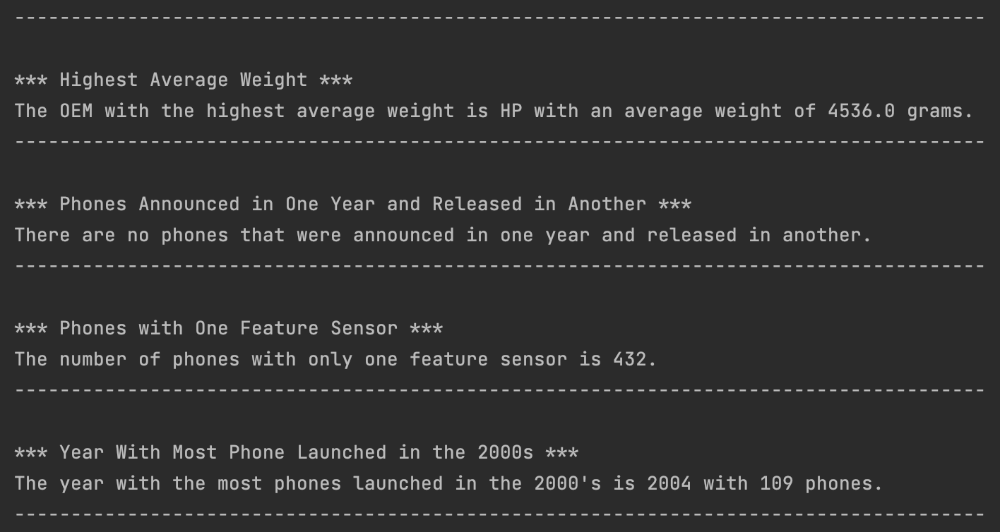

# Java - Alternate Programming Language Project

I picked Java because it's the language I'm familiar with, and it facilitates an easier transition from the previously implemented C# program. 

Java is a language designed around the principles of `Object-Oriented Programming (OOP)`, which means you can build your programs around objects that encapsulate data and the code that manipulates it, incorporating concepts such as classes, objects, inheritance, encapsulation, and polymorphism. These features enable developers to structure their code in a modular and organized manner, thereby facilitating code reuse and maintenance.

When it comes to file ingestion, Java provides a variety of classes and utilities to handle file operations. Developers can use classes like `File`, `FileReader`, `BufferedReader`, and `Scanner` to read data from files efficiently. Additionally, Java supports input/output operations through `streams`, allowing for seamless interaction with files and other data sources.

Conditional statements in Java, including `if`, `else if`, and `else`, enable developers to control the flow of execution based on certain conditions. These statements are fundamental for implementing decision-making logic within Java programs, allowing for branching and alternative execution paths.

Assignment statements in Java, utilizing the `=` operator, enable developers to assign values to variables, facilitating data manipulation and storage within Java programs. These statements are crucial for initializing variables, updating their values, and performing various calculations and operations.

Java offers various types of loops, including `for`, `while`, and `do-while loops`, allowing developers to execute blocks of code repeatedly based on specific conditions or iterations. Loops are essential for iterating over arrays, collections, or executing repetitive tasks until certain conditions are met.

Subprograms, commonly referred to as methods or functions, are a key feature of Java programming. Methods in Java are defined within classes and are used to define the behavior of objects or perform specific tasks. Java supports static methods, instance methods, and method overloading, providing flexibility in defining reusable code blocks.

For unit testing, Java provides the `JUnit framework`, a widely-used testing tool for writing and executing test cases to validate individual units of code. Additionally, developers can leverage other testing frameworks like `TestNG` to perform comprehensive testing and ensure the quality and reliability of Java applications.

Exception handling in Java is achieved using `try`, `catch`, `finally`, and `throw` keywords, allowing developers to gracefully handle runtime errors and exceptional conditions. Java's exception handling mechanism helps maintain program stability and robustness by providing a structured approach to dealing with unexpected situations.

The initial libraries employed are `java.util.HashSet`, `java.util.HashMap`, and `java.util.ArrayList`. These structures are utilized for storing and managing data efficiently, chosen for their proficiency in tasks like handling unique elements, maintaining key-value pairs, and managing dynamically sized collections. Following these are `java.io.BufferedReader` and `java.io.FileReader`, utilized for reading data from files. These classes are preferred for their convenience and effectiveness in reading data from files line by line, a common necessity in many Java applications. Lastly, `java.util.String` is utilized for various string manipulation tasks, including parsing data, extracting substrings, and performing conversions. The extensive range of methods provided by the String class facilitates efficient manipulation of strings, making it suitable for tasks like parsing CSV lines and extracting specific data elements. 

## Questions
**What company (oem) has the highest average weight of the phone body?**

  - HP has the highest average weight of the phone body 4536 grams.

**Was there any phones that were announced in one year and released in another? What are they? Give me the oem and models.**

  - There is no phone that were announced and realeased in different year.

**How many phones have only one feature sensor?**

  - There are 432 phones with one feature sensor.

**What year had the most phones launched in the 2000s?**

  - 2004 has the most phones launched in the 2000s with 109 phones.

## Output

